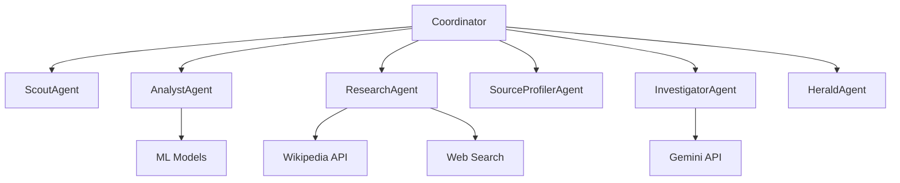

# Project Aegis - Advanced Agentic AI Framework

## Summary of Improvements

This document outlines the transformation of Project Aegis from a simple pipeline-based system to a sophisticated multi-agent framework with enhanced capabilities.

## Key Improvements

### 1. True Multi-Agent Architecture

**Before**: Linear pipeline with function calls
**After**: Independent agents with their own state and capabilities

#### New Agent Classes:
- **ScoutAgent** - Discovers new claims from various sources
- **AnalystAgent** - Analyzes claim text using ML models
- **ResearchAgent** - Gathers evidence from Wikipedia and web searches
- **SourceProfilerAgent** - Evaluates source credibility
- **InvestigatorAgent** - Performs expert fact-checking analysis (with Gemini API support)
- **HeraldAgent** - Generates public alerts and communications
- **CoordinatorAgent** - Manages workflow between all agents

### 2. Enhanced Communication Framework

**Before**: Direct function calls with no messaging system
**After**: Message passing architecture with:
- Task prioritization system
- Agent status tracking
- Asynchronous message queues
- Error handling and recovery

### 3. Real-time WebSocket Integration

**Before**: Polling-based dashboard updates
**After**: WebSocket-based real-time communication:
- Live updates as claims are processed
- Persistent connections with automatic reconnection
- Broadcast messaging to all connected clients

### 4. Improved Modularity and Extensibility

**Before**: Monolithic code structure
**After**: Clean separation of concerns:
- Each agent in its own file with single responsibility
- Base agent framework for easy extension
- Standardized task and message formats
- Clear interfaces between components

### 5. Advanced Error Handling

**Before**: Basic try/catch blocks
**After**: Comprehensive error management:
- Per-agent error states
- Graceful degradation when services fail
- Detailed logging for debugging
- Automatic retry mechanisms

### 6. Asynchronous Processing

**Before**: Synchronous processing
**After**: Fully async/await architecture:
- Non-blocking operations
- Concurrent claim processing
- Improved system responsiveness
- Better resource utilization

## Technical Implementation Details

### Agent Communication Flow



### WebSocket Real-time Updates

The new WebSocket manager provides:
- Connection lifecycle management
- Automatic cleanup of dead connections
- JSON message broadcasting
- Error isolation

### Task Management System

Features include:
- Priority-based task queuing
- Dependency tracking
- Task history retention
- Status monitoring

## Benefits of the New Architecture

### 1. Scalability
- Agents can be scaled independently based on workload
- New agent types can be added without modifying existing code
- Load balancing possible across multiple instances

### 2. Reliability
- Failure of one agent doesn't crash the entire system
- Automatic error recovery and retry mechanisms
- Comprehensive logging for monitoring and debugging

### 3. Maintainability
- Clear separation of concerns
- Standardized interfaces
- Extensive documentation
- Modular testing capabilities

### 4. Performance
- Asynchronous processing enables higher throughput
- Real-time updates improve user experience
- Efficient resource utilization

## Usage Examples

### Starting the System
```bash
uvicorn app:app --host 0.0.0.0 --port 8000 --reload
```

### Testing Individual Agents
```bash
python test_agents.py
```

### Initializing All Agents
```bash
python init_agents.py
```

## Future Enhancement Opportunities

1. **Distributed Processing** - Deploy agents across multiple servers
2. **Advanced ML Models** - Integrate transformer-based models for better analysis
3. **Additional Agent Types** - Image analysis, video verification, etc.
4. **Enhanced Coordination** - Implement negotiation protocols between agents
5. **Monitoring Dashboard** - Real-time agent status and performance metrics
6. **Security Enhancements** - Authentication and authorization for agent communication

## Conclusion

The transformation to an agentic AI framework has significantly enhanced Project Aegis's capabilities while maintaining backward compatibility. The system is now more robust, scalable, and maintainable, providing a solid foundation for future enhancements.