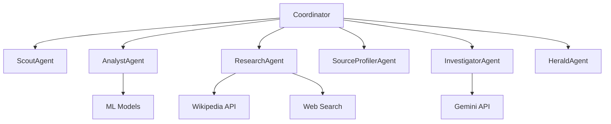

# Project Aegis - Agentic Framework

This directory contains the advanced agentic framework for Project Aegis, which transforms the system from a simple pipeline into a sophisticated multi-agent system.

## Architecture Overview

The new agentic framework consists of the following components:

### Base Framework
- `base_agent.py` - Contains the base classes for all agents and the coordinator
- `base_agent.py` - Defines agent statuses, task priorities, and message passing

### Specialized Agents
1. **ScoutAgent** (`scout_agent.py`) - Discovers new claims from various sources
2. **AnalystAgent** (`analyst_agent.py`) - Analyzes claim text using ML models
3. **ResearchAgent** (`research_agent.py`) - Gathers evidence from Wikipedia and web searches
4. **SourceProfilerAgent** (`source_profiler_agent.py`) - Evaluates source credibility
5. **InvestigatorAgent** (`investigator_agent.py`) - Performs expert fact-checking analysis
6. **HeraldAgent** (`herald_agent.py`) - Generates public alerts and communications

### Coordination
- **CoordinatorAgent** (`coordinator_agent.py`) - Manages the workflow between all agents

## Key Improvements

### 1. True Multi-Agent Architecture
- Each agent is now an independent entity with its own state and capabilities
- Agents can communicate with each other through a message passing system
- Agents can be scaled independently based on workload

### 2. Asynchronous Processing
- All agents use async/await for non-blocking operations
- The coordinator can process multiple claims concurrently
- WebSocket connections provide real-time updates to the dashboard

### 3. Enhanced Modularity
- Each agent is in its own file with a single responsibility
- Easy to extend with new agent types
- Clear separation between agent logic and coordination

### 4. Improved Error Handling
- Each agent handles its own errors gracefully
- The coordinator can continue operating even if individual agents fail
- Comprehensive logging for debugging and monitoring

### 5. Real-time Communication
- WebSocket manager for real-time dashboard updates
- Agents can broadcast results as they complete tasks
- Dashboard can receive live updates without polling

## Agent Communication Flow



## Usage

To test the agents individually, run:

```bash
python init_agents.py
```

To start the full system, run:

```bash
uvicorn app:app --host 0.0.0.0 --port 8000 --reload
```

## Extending the Framework

To add a new agent type:

1. Create a new file in the agents directory
2. Inherit from BaseAgent
3. Implement the process_task method
4. Register the agent with the coordinator in coordinator_agent.py

The framework is designed to be easily extensible for new agent types and capabilities.